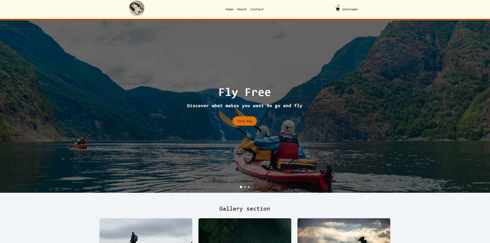
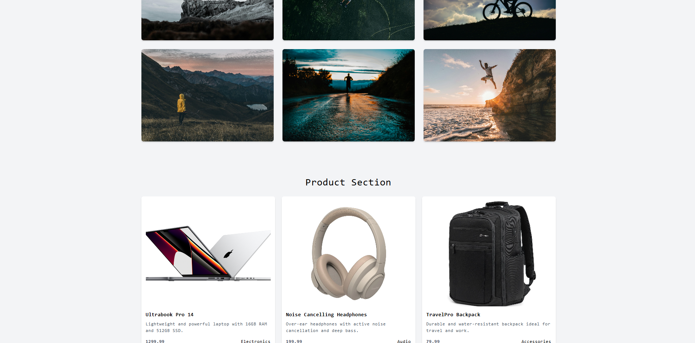
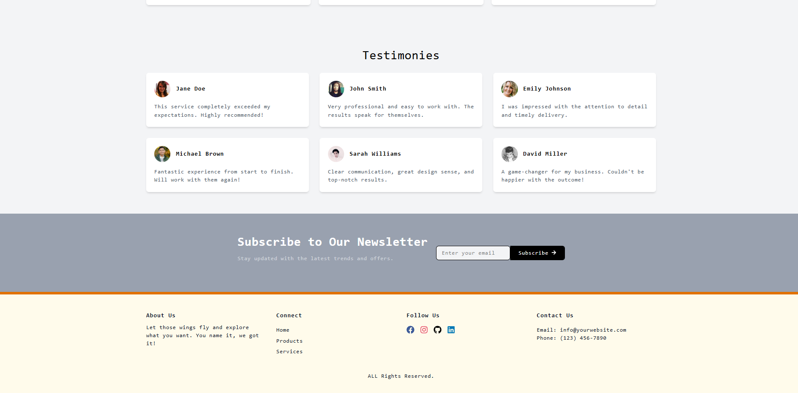

# 🛍️ Next.js + TypeScript + Tailwind Practice E-Commerce App

This project is a **frontend e-commerce website** built as a practice exercise to learn and apply:

- **Next.js** (App Router)
- **TypeScript**
- **Tailwind CSS**

It serves as a showcase of my understanding of modern frontend development, component structuring, and responsive design using the latest React-based stack.

## 🌟 Hero Section

## 📸 Product/Gallery Section

## 📝 Testimonial/Footer Section

---

## 🔧 Features

- ⚛️ Built with **Next.js** using the **App Router**
- 💅 Styled with **Tailwind CSS**
- 💡 Fully typed with **TypeScript**
- 🧱 Reusable and organized components
- 🖼️ Gallery section with hover effects
- 📦 Product listing cards with prices
- 🧭 Navigation bar with links to "Home", "About", and "Contact"
- 🗞️ Newsletter section (visual only)
- 🗣️ Testimonial section
- 🦶 Clean footer layout
- 🎯 Responsive layout for modern screen sizes

> ⚠️ **Note:** This is a frontend-only project — no backend functionality is implemented. Cart, product interactions, and forms are **not wired up**. Components are hardcoded to simulate UI structure and flow.

## 📚 Purpose

This project was created as part of my personal learning journey into full-stack development. The goal was to gain confidence working with the Next.js framework, static site generation, component-based architecture, and styling using utility-first CSS with Tailwind.

## 🚀 Next Steps

- Add real product data and functionality
- Implement a backend with API integration
- Enable interactive cart and form submissions
- Add authentication and user flow

---

Thanks for checking out this practice project! Feel free to fork it, give feedback, or follow my journey as I build more ambitious apps!
Link to live demo (NotWorking Currently): https://next-typescript-practice-nine.vercel.app/
